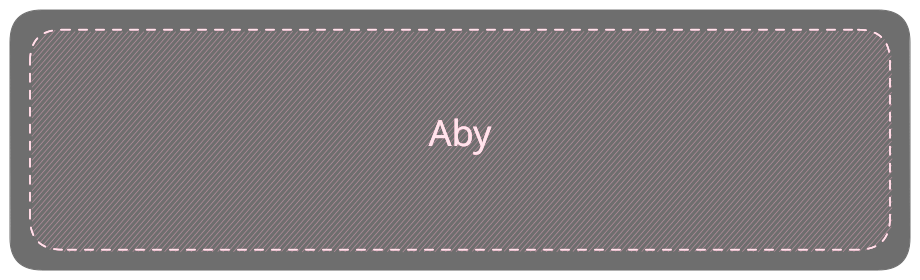

# Aby: Aby's Internal Dev Tool

[](https://github.com/AbyStudioDev/Aby/actions/workflows/sdk.yml)



## Getting Started

TODO

## Debugging

```
.sympath+ "C:\Aby\Aby\runtimes\Unity\Assets\Plugins\EcmaRuntime"
.reload
kv
```